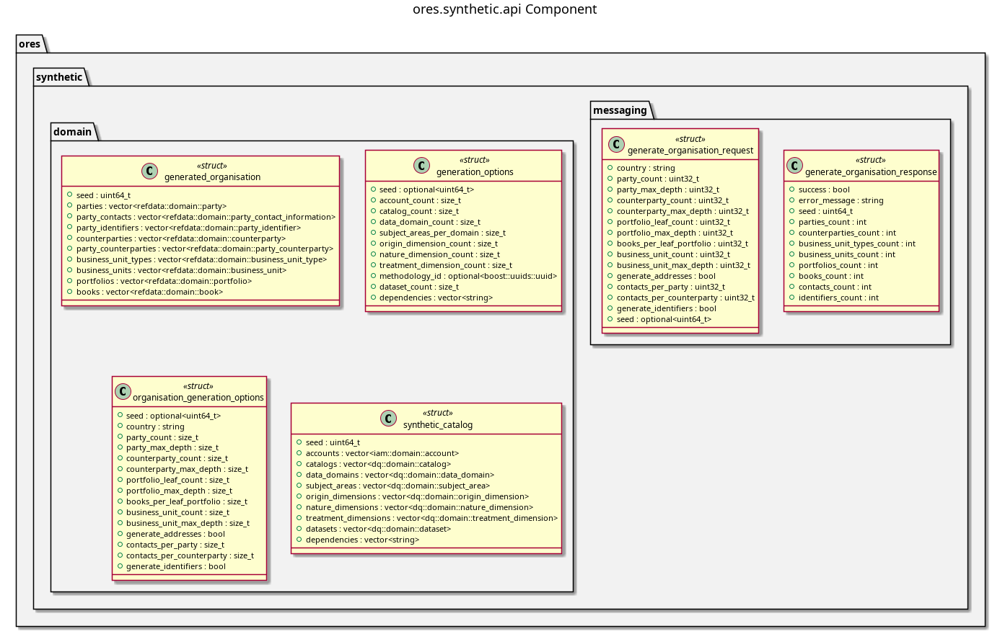

:PROPERTIES:
:ID: 44039E5B-3435-4BCB-824F-3990AF341FBE
:END:
#+title: ores.synthetic.api
#+name: synthetic.api
#+full_name: ores.synthetic.api
#+description: Domain types and NATS protocol schemas for the synthetic data component.
#+type: ores.codegen.component
#+level: cross
#+filetags: :synthetic:api:component:
#+created: 2026-05-19
#+updated: 2026-05-19

* Diagram

#+attr_html: :width 100% :alt ores.synthetic.api component diagram
#+caption: ores.synthetic.api

* Summary

=ores.synthetic.api= is a header-only library defining the domain types and
NATS protocol schemas for the synthetic data component. It provides types for
generated organisations, generation options, and synthetic catalogs, consumed
by =ores.synthetic.core= (server) and any client requesting catalog generation.

* Inputs

- Domain entity type definitions: =generated_organisation.hpp=,
  =generation_options.hpp=, =organisation_generation_options.hpp=,
  =synthetic_catalog.hpp=.

* Outputs

- C++ headers for all synthetic-data domain types.
- NATS protocol headers for catalog generation requests and responses.

* Entry points

- =include/ores.synthetic.api/domain/= — all domain entity headers.
- =include/ores.synthetic.api/messaging/= — NATS protocol message headers.

* Dependencies

- =rfl= — JSON serialisation via reflection.

* See also

- [[id:DC252F72-1BB0-4CC8-B558-C191FFA5E826][ores.synthetic.core]] — business logic and NATS handlers.
- [[id:7AF2DCAB-BC62-43A9-885A-E557FCD4254F][ores.synthetic Messaging Reference]] — full NATS subject and message catalogue.
