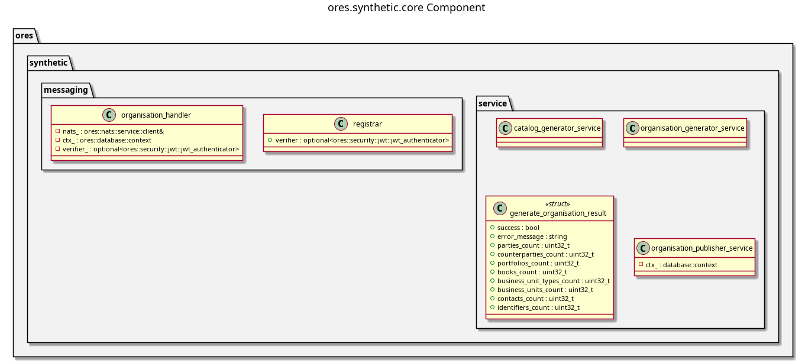

:PROPERTIES:
:ID: DC252F72-1BB0-4CC8-B558-C191FFA5E826
:END:
#+title: ores.synthetic.core
#+name: synthetic.core
#+full_name: ores.synthetic.core
#+description: Synthetic DQ catalog generation — produces realistic test data structures compatible with ores.dq.
#+type: ores.codegen.component
#+level: cross
#+filetags: :synthetic:core:component:
#+created: 2026-05-19
#+updated: 2026-05-19

* Diagram

#+attr_html: :width 100% :alt ores.synthetic.core component diagram
#+caption: ores.synthetic.core

* Summary

=ores.synthetic.core= generates synthetic data-quality catalog structures for
development and testing in ORE Studio. It produces realistic =Organisation=
hierarchies, generation-options configurations, and =SyntheticCatalog= trees
compatible with =ores.dq= catalog formats, enabling the full DQ pipeline to
be exercised without exposing real client data. A NATS handler layer exposes
generation operations to remote callers.

* Inputs

- NATS request messages triggering catalog generation (organisation count,
  depth parameters, seed options).
- Configuration injected by the host (=ores.synthetic.service=).

* Outputs

- Generated =Organisation= and =SyntheticCatalog= structures returned via NATS
  response messages.
- Test data importable directly into the =ores_dq= schema via the DQ pipeline.

* Entry points

- =include/ores.synthetic.core/ores.synthetic.hpp= — aggregate include.
- =include/ores.synthetic.core/messaging/registrar.hpp= — registers all NATS
  handlers with the service host.
- =include/ores.synthetic.core/generators/= — synthetic data factory classes.

* Dependencies

- =ores.synthetic.api= — shared domain types and NATS protocol schemas.
- =ores.dq= — target catalog formats consumed by the generated data.
- =nats.c= — NATS messaging client.

* See also

- [[id:44039E5B-3435-4BCB-824F-3990AF341FBE][ores.synthetic.api]] — protocol types and domain entities.
- [[id:702753E8-0E07-4690-AFAB-D75514ADE660][ores.synthetic.service]] — NATS service entrypoint.
- [[id:7AF2DCAB-BC62-43A9-885A-E557FCD4254F][ores.synthetic Messaging Reference]] — full NATS subject and message catalogue.
