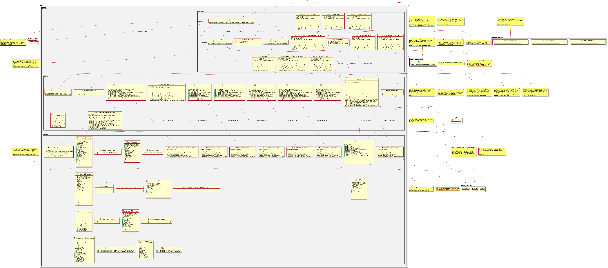

:PROPERTIES:
:ID: DC252F72-1BB0-4CC8-B558-C191FFA5E826
:END:
#+title: ores.synthetic.core
#+name: synthetic.core
#+full_name: ores.synthetic.core
#+description: Server-side implementation of the synthetic entities: repositories, services, NATS handlers, and the original catalog generators.
#+type: ores.codegen.component
#+level: cross
#+filetags: :synthetic:core:component:
#+created: 2026-05-19
#+updated: 2026-09-08

* Diagram

#+attr_html: :width 100% :alt ores.synthetic.core component diagram
#+caption: ores.synthetic.core

* Summary

=ores.synthetic.core= implements the server side of the synthetic data
component. Each of the nine bound entities has a generated repository,
mapper, entity, service, NATS handler with sub-registrar, history provider
registrar, and history field mapper. =messaging/registrar.cpp= composes all
handlers and history providers into the service host. The facet also keeps
the component's original catalog and organisation generation services, which
produce synthetic test data for the DQ pipeline.

* Inputs

- NATS request messages for entity CRUD, history, feed configuration, and
  feed control, decoded with the =ores.synthetic.api= protocol headers.
- Database context supplied by the host (=ores.synthetic.service=), carrying
  the tenant and party scope the RLS policies enforce.

* Outputs

- Entity rows written to the =ores_synthetic_= tables, with version history.
- NATS responses for every registered subject.
- Synthetic organisation hierarchies and catalogs returned to callers.

* Entry points

- =include/ores.synthetic.core/messaging/registrar.hpp= — registers all NATS
  handlers and history providers with the service host.
- =include/ores.synthetic.core/service/= — one service class per entity.
- =include/ores.synthetic.core/repository/= — one repository class per entity.
- =src/generators/= and =src/data/= — the catalog and organisation generators.

* Dependencies

- =ores.synthetic.api= — domain types, protocol schemas, and feeds.
- =ores.eventing= — change event publication.
- =ores.database= — execution context and party scope.
- =nats.c= — NATS messaging client.

* See also

- [[id:44039E5B-3435-4BCB-824F-3990AF341FBE][ores.synthetic.api]] — protocol types and domain entities.
- [[id:702753E8-0E07-4690-AFAB-D75514ADE660][ores.synthetic.service]] — NATS service entrypoint.
- [[id:7AF2DCAB-BC62-43A9-885A-E557FCD4254F][ores.synthetic Messaging Reference]] — full NATS subject and message catalogue.
