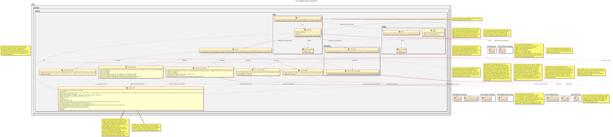

:PROPERTIES:
:ID: 702753E8-0E07-4690-AFAB-D75514ADE660
:END:
#+title: ores.synthetic.service
#+description: NATS service entrypoint for the synthetic data component.
#+type: ores.codegen.component
#+level: cross
#+filetags: :synthetic:service:component:
#+created: 2026-05-19
#+updated: 2026-09-08
#+name: synthetic.service
#+full_name: ores.synthetic.service
#+brief: Synthetic data service entrypoint

* Diagram

#+attr_html: :width 100% :alt ores.synthetic.service component diagram
#+caption: ores.synthetic.service

* Summary

=ores.synthetic.service= is the NATS service entrypoint for the synthetic
data domain. It reads configuration, opens the NATS connection, and runs the
event loop. Composition happens in two places: =registrar.cpp= registers the
entity handlers and history providers from =ores.synthetic.core=, and the
per-entity event registrars in =messaging/= wire the DB-notify to NATS
publish chain for each changed event. The feed control plane (feed
configuration, feed start and stop, folder feed control, IR curve preview,
simulation, and vintage validity handlers) also lives here.

* Inputs

- Configuration file: NATS server URL and environment settings.
- NATS request messages for entity CRUD, feed configuration and control,
  simulation, and preview.

* Outputs

- A running NATS service handling all synthetic data subjects.
- NATS response messages returned to callers.
- Structured logs via =ores.logging=.

* Entry points

- =src/main.cpp= — process entry point.
- =src/app/= — application bootstrap and dependency injection.
- =src/registrar.cpp= — handler and history provider composition.
- =src/messaging/= — per-entity event registrars.

* Dependencies

- =ores.synthetic.core= — all entity handlers and services.
- =ores.synthetic.api= — shared protocol types and feeds.
- =ores.logging= — structured logging infrastructure.
- =nats.c= — NATS client for connection management.

* See also

- [[id:DC252F72-1BB0-4CC8-B558-C191FFA5E826][ores.synthetic.core]] — repositories, services, and NATS handlers.
