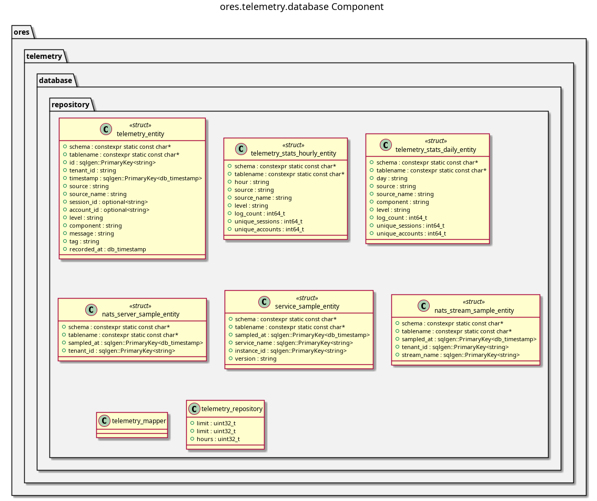

:PROPERTIES:
:ID: 59B10B09-8E69-4994-A11B-ECBD79E2446C
:END:
#+title: ORE Studio Telemetry Database Component
#+author: Marco Craveiro
#+options: <:nil c:nil todo:nil ^:nil d:nil date:nil author:nil toc:nil html-postamble:nil
#+startup: inlineimages

Database support for the telemetry component.

* Component Architecture

#+attr_html: :width 100% :alt ores.telemetry.database Component Diagram
#+caption: ORE Studio Telemetry Database Component Diagram

