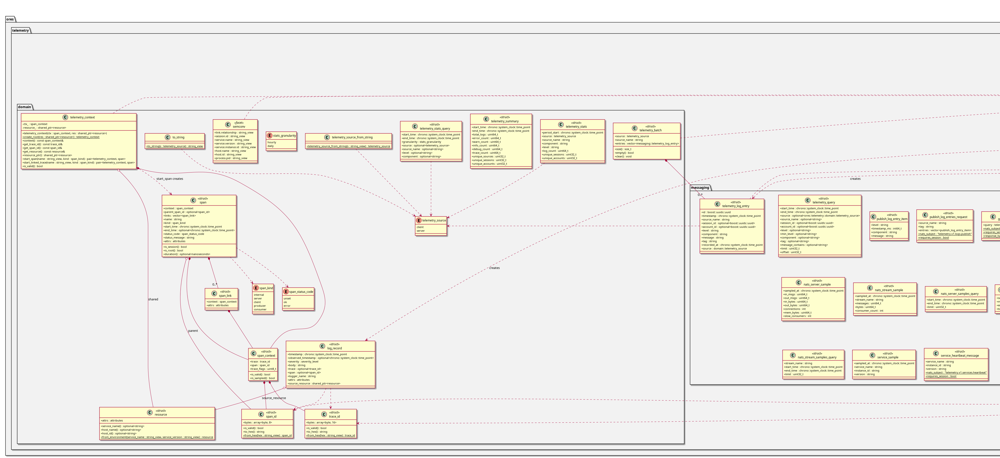

:PROPERTIES:
:ID: 8A2B3C4D-5E6F-7A8B-9C0D-1E2F3A4B5C6D
:END:
#+title: ores.telemetry.core
#+name: telemetry.core
#+full_name: ores.telemetry.core
#+description: Observability library — structured logging, distributed tracing, and the messaging types the telemetry subjects carry.
#+type: ores.codegen.component
#+level: cross
#+filetags: :telemetry:core:component:
#+created: 2026-05-19
#+updated: 2026-05-19

* Diagram

#+attr_html: :width 100% :alt ores.telemetry.core component diagram
#+caption: ores.telemetry.core

* Summary

=ores.telemetry.core= is the observability library for ORE Studio. It provides
structured logging via Boost.Log with trace and span ID correlation (aligned
with OpenTelemetry semantics), the messaging types the service exchanges, and
domain types for log records and resource identity (host, service, version).
All other components link against this library to emit structured, correlated
logs, and the sink the host installs decides where a record goes: the database
sink writes it through =ores.telemetry.database=.

* Inputs

- Log events emitted by other components via the Boost.Log sink interface.
- Configuration for the log level, the service identity and the record's
  source.

* Outputs

- Structured =log_record= objects handed to the sink the host installs.
- The message and payload types the six =telemetry.v1.>= subjects carry,
  generated from the three operation models.

* Entry points

- =include/ores.telemetry.core/log/= — Boost.Log initialisation, the lifecycle
  manager and the sinks.
- =include/ores.telemetry.core/generators/= — trace/span ID generators.
- =include/ores.telemetry.core/domain/= — log_record, trace_id, span_id, resource.
- =include/ores.telemetry.core/messaging/= — the generated protocol headers.
- =include/ores.telemetry.core/exporting/= — logging configuration and options.

* Dependencies

- Boost.Log — structured logging sink infrastructure.

* See also

- [[id:DF0CAAB9-9DDB-4FEA-82D3-71FAC2177EEF][ores.telemetry.service]] — NATS service that receives and persists log records.
- [[id:B73EAF3C-1384-4882-9310-8E9DB594C038][ores.telemetry.database]] — persistence layer for telemetry records.
- [[id:A6B7C8D9-E0F1-2345-ABCD-456789012345][ores.telemetry Messaging Reference]] — NATS protocol for log forwarding.
