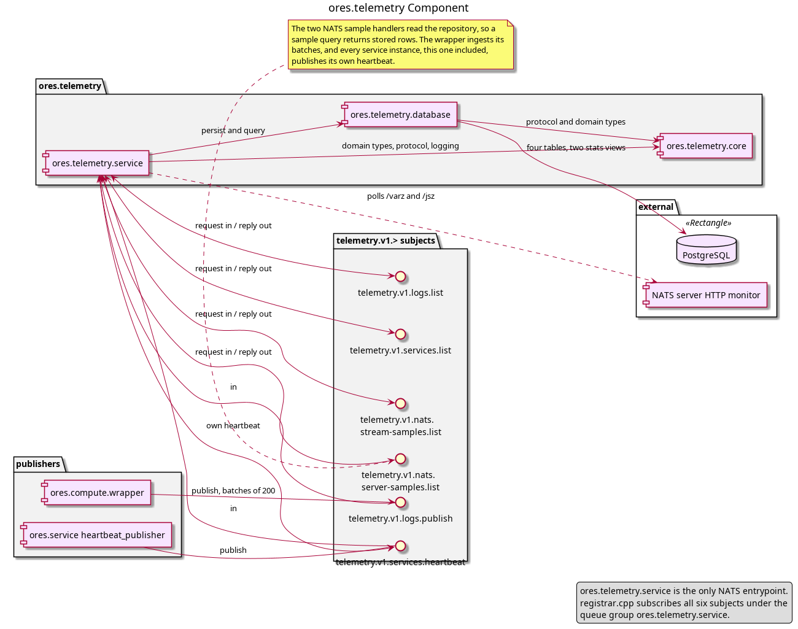

:PROPERTIES:
:ID: F9757D88-A92E-474E-9E8E-C703D604A0B2
:END:
#+title: ores.telemetry
#+description: Observability component: structured logs, service heartbeats, and NATS server and stream samples, gathered over the telemetry.v1.> namespace and stored in its own tables.
#+type: ores.codegen.component
#+level: cross
#+filetags: :telemetry:component:
#+created: 2026-09-26
#+updated: 2026-09-26
#+name: telemetry
#+full_name: ores.telemetry
#+brief: Telemetry ingestion, storage, and query component
#+component_kind: composite
#+parts: core database service

* Diagram

#+attr_html: :width 100% :alt ores.telemetry component diagram
#+caption: ores.telemetry

* Summary

=ores.telemetry= is the observability component for ORE Studio. It receives
log entries, service heartbeats, and NATS server and stream samples, persists
them in its own tables, and answers queries over the stored data. Every
component links its core part for logging and trace correlation.

It is a composite of three parts, and the parts carry the component's
documented sections, because the work is divided between them.

* Sub-components

| Part | Role |
|------+------|
| [[id:8A2B3C4D-5E6F-7A8B-9C0D-1E2F3A4B5C6D][ores.telemetry.core]] | The logging, tracing and record types every component links: the Boost.Log front end, the trace and span identifiers, the semantic conventions, and the messaging types the service exchanges. |
| [[id:B73EAF3C-1384-4882-9310-8E9DB594C038][ores.telemetry.database]] | PostgreSQL persistence for the four stored shapes, and the sink that writes a log record straight to the database. |
| [[id:DF0CAAB9-9DDB-4FEA-82D3-71FAC2177EEF][ores.telemetry.service]] | The NATS service that serves the six =telemetry.v1.>= subjects, polls the NATS HTTP monitoring API, and runs the retention and aggregation work. |

* Entity modules

None. The component owns five tables, but it models no entity and no
junction, so no entity module generates its schema, its repository or its
shell surface: the tables, their triggers and their row-level security
policies stay hand-written.

What it models are its messages. Three operation models declare the six
messages and the payloads they carry, and generate the protocol headers under
=core/include/ores.telemetry.core/messaging/=:

| Model | Generated header |
|-------+------------------|
| =ores.telemetry.logs.org= | =logs_protocol.hpp= |
| =ores.telemetry.nats_samples.org= | =nats_samples_protocol.hpp= |
| =ores.telemetry.service_samples.org= | =service_samples_protocol.hpp= |

The aggregation functions the database part reads are a recorded capture:
nothing can ask for them until a subject and its models exist.

* See also

- [[id:8A2B3C4D-5E6F-7A8B-9C0D-1E2F3A4B5C6D][ores.telemetry.core]] — observability library that produces log records.
- [[id:B73EAF3C-1384-4882-9310-8E9DB594C038][ores.telemetry.database]] — persistence layer for telemetry records.
- [[id:DF0CAAB9-9DDB-4FEA-82D3-71FAC2177EEF][ores.telemetry.service]] — NATS service that serves the namespace.
- [[id:A6B7C8D9-E0F1-2345-ABCD-456789012345][ores.telemetry Messaging Reference]] — the six subjects, their messages and who sends what.
- [[id:C9C24C99-F16C-45BE-A262-1C0F4502765E][ores.nats]] — messaging transport used by the service.
