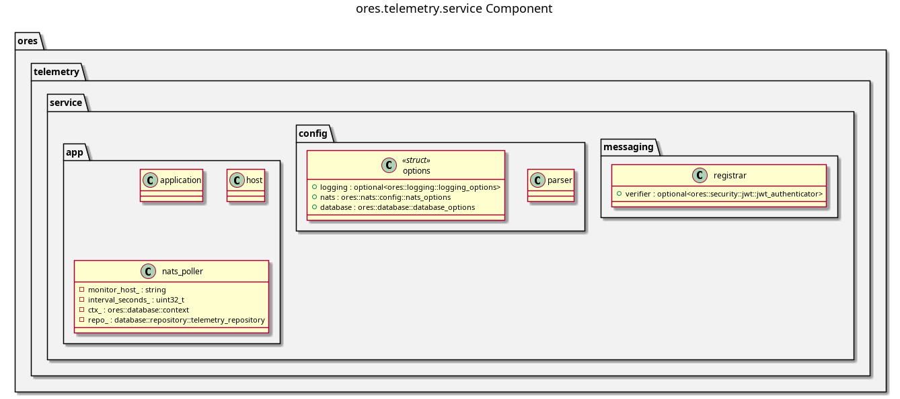

:PROPERTIES:
:ID: DF0CAAB9-9DDB-4FEA-82D3-71FAC2177EEF
:END:
#+title: ores.telemetry.service
#+description: NATS service entrypoint for the telemetry domain — receives and persists log records.
#+type: ores.codegen.component
#+level: cross
#+filetags: :telemetry:service:component:
#+created: 2026-05-19
#+updated: 2026-05-19
#+name: telemetry.service
#+full_name: ores.telemetry.service
#+brief: Telemetry and metrics streaming service

* Diagram

#+attr_html: :width 100% :alt ores.telemetry.service component diagram
#+caption: ores.telemetry.service

* Summary

=ores.telemetry.service= is the NATS service entrypoint that receives log
records from other services and persists them to the telemetry database. It
registers NATS handlers for log ingestion, runs the event loop, and forwards
records to =ores.telemetry.database= for storage.

* Inputs

- Configuration file: NATS server URL, PostgreSQL connection string.
- NATS messages from =ores.telemetry.core= hybrid exporter containing
  serialised =log_record= objects.

* Outputs

- Log records persisted to the =ores_telemetry= schema via
  =ores.telemetry.database=.
- NATS acknowledgements returned to senders.

* Entry points

- =src/main.cpp=, =src/app/=, =src/config/=.

* Dependencies

- =ores.telemetry.database=, =ores.telemetry.core=, =ores.logging=, =nats.c=.

* See also

- [[id:8A2B3C4D-5E6F-7A8B-9C0D-1E2F3A4B5C6D][ores.telemetry.core]] — logging library and hybrid exporter.
- [[id:B73EAF3C-1384-4882-9310-8E9DB594C038][ores.telemetry.database]] — database persistence layer.
