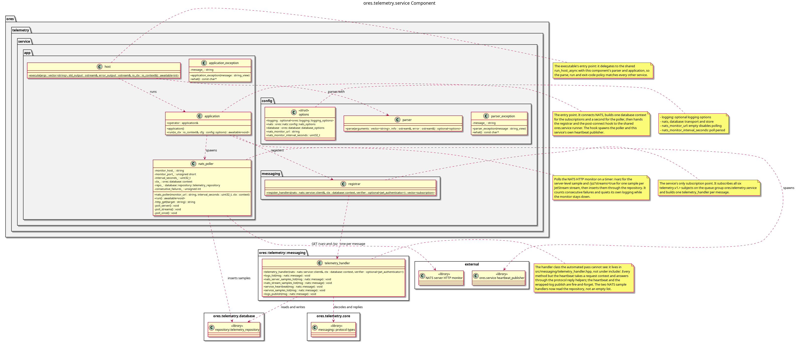

:PROPERTIES:
:ID: DF0CAAB9-9DDB-4FEA-82D3-71FAC2177EEF
:END:
#+title: ores.telemetry.service
#+description: NATS service entrypoint for the telemetry domain — receives and persists log records.
#+type: ores.codegen.component
#+level: cross
#+filetags: :telemetry:service:component:
#+created: 2026-05-19
#+updated: 2026-05-19
#+name: telemetry.service
#+full_name: ores.telemetry.service
#+brief: Telemetry and metrics streaming service

* Diagram

#+attr_html: :width 100% :alt ores.telemetry.service component diagram
#+caption: ores.telemetry.service

* Summary

=ores.telemetry.service= is the NATS service entrypoint that receives log
records from other services and persists them to the telemetry database. It
registers NATS handlers for log ingestion, runs the event loop, and forwards
records to =ores.telemetry.database= for storage.

* Inputs

- Configuration file: NATS server URL, PostgreSQL connection string.
- NATS messages on the six =telemetry.v1.>= subjects: log entries published by
  wrapper nodes, heartbeats from every service, and the four queries.
- NATS server and stream samples the service polls from the NATS HTTP
  monitoring API.

* Outputs

- Log records, service samples and NATS samples persisted to the =ores_telemetry=
  schema via =ores.telemetry.database=.
- Replies to the four query subjects.

* Entry points

- =src/main.cpp=, =src/app/=, =src/config/=, =src/messaging/=.

* Dependencies

- =ores.telemetry.database=, =ores.telemetry.core=, =ores.service=, =ores.nats=,
  =ores.logging=, =nats.c=.

* See also

- [[id:8A2B3C4D-5E6F-7A8B-9C0D-1E2F3A4B5C6D][ores.telemetry.core]] — logging library and the messaging types this service serves.
- [[id:B73EAF3C-1384-4882-9310-8E9DB594C038][ores.telemetry.database]] — database persistence layer.
- [[id:A6B7C8D9-E0F1-2345-ABCD-456789012345][ores.telemetry Messaging Reference]] — the six subjects and their handlers.
- [[id:C9C24C99-F16C-45BE-A262-1C0F4502765E][ores.nats]] — the transport this service subscribes and replies through.
