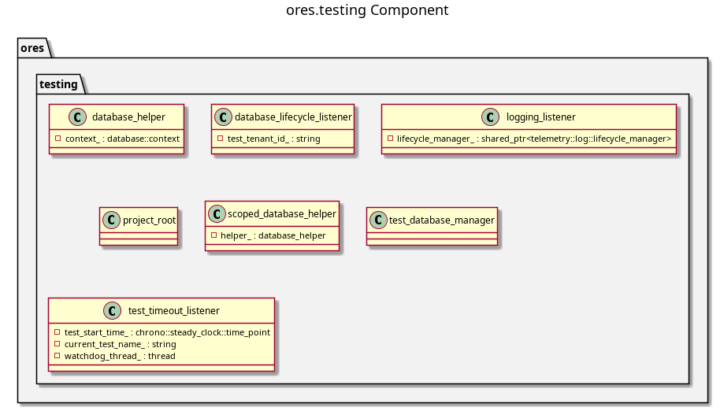

:PROPERTIES:
:ID: 7F58FF13-5A85-49C4-09BB-EED86B874ABB
:END:
#+title: ores.testing
#+name: testing
#+full_name: ores.testing
#+description: Catch2-based testing infrastructure — database isolation, per-test logging, tenant RLS helpers, and coroutine test support.
#+type: ores.codegen.component
#+level: cross
#+filetags: :testing:infrastructure:component:
#+created: 2026-05-20
#+updated: 2026-05-20

* Diagram

#+attr_html: :width 100% :alt ores.testing component diagram
#+caption: ores.testing

* Summary

=ores.testing= provides the shared Catch2 testing infrastructure for all ORE
Studio test suites. It supplies Catch2 event listeners for per-test logging
(=logging_listener=), database lifecycle management (=database_lifecycle_listener=:
creates and drops a unique database per test process for parallel execution),
scoped database helpers for table truncation and tenant RLS context, and
coroutine test support. Tests depend on =TEST_ORES_DB_*= environment variables
or the project =.env= file for database credentials.

* Inputs

- =TEST_ORES_DB_*= environment variables (or =.env=) with database credentials.
- Catch2 test runner linked against this library.

* Outputs

- Isolated per-process PostgreSQL databases created before tests and dropped
  after.
- Boost.Log output routed per test case with suite-based organisation.

* Entry points

- =include/ores.testing/logging_listener.hpp= — Catch2 log listener.
- =include/ores.testing/database_lifecycle_listener.hpp= — database create/drop.
- =include/ores.testing/scoped_database_helper.hpp= — truncation and RLS helpers.
- =include/ores.testing/run_coroutine_test.hpp= — coroutine test runner.
- =include/ores.testing/make_generation_context.hpp= — codegen test helpers.

* Dependencies

- Catch2 — test framework.
- =ores.database= — connection pool and tenant context for test helpers.
- =ores.logging= — per-test log routing.

* See also

-
