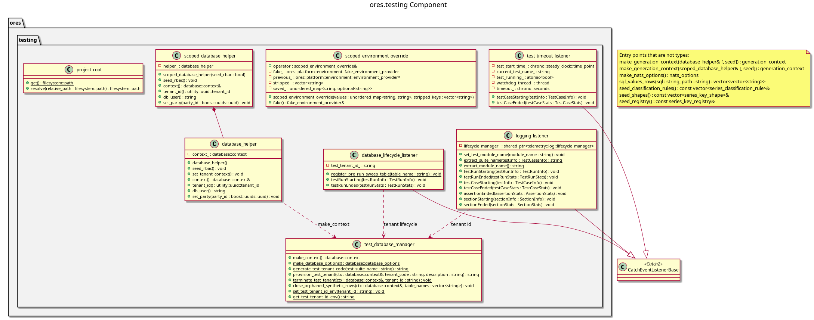

:PROPERTIES:
:ID: 7F58FF13-5A85-49C4-09BB-EED86B874ABB
:END:
#+title: ores.testing
#+name: testing
#+full_name: ores.testing
#+description: Catch2 test infrastructure — a PostgreSQL tenant per test run, per-test logging, database context helpers, and readers for the SQL populate scripts.
#+type: ores.codegen.component
#+level: cross
#+filetags: :testing:infrastructure:component:
#+created: 2026-05-20
#+updated: 2026-09-26

* Diagram

#+attr_html: :width 100% :alt ores.testing component diagram
#+caption: ores.testing

* Summary

=ores.testing= is the shared infrastructure every ORE Studio test suite builds
on. Each test run gets its own PostgreSQL tenant inside one shared database, so
parallel suites cannot see each other's rows, and the tenant is terminated when
the run ends. The component routes Boost.Log output per test case, hands out
database contexts bound to the test tenant, and reads the SQL populate scripts
so that a suite asserts against the seed the loader actually writes. Its
consumers are the test binaries of the production components, never production
code.

* Inputs

- =ORES_TEST_DB_*= environment variables (or =.env=) with the database user,
  password, host, database, port and tenant.
- =ORES_TEST_LOG_ENABLED=, =ORES_TEST_LOG_LEVEL=, =ORES_TEST_LOG_CONSOLE= and
  =ORES_TEST_LOG_DATABASE=, which switch per-test logging on and choose where it
  goes.
- =ORES_TEST_TIMEOUT_SECONDS=, the per-test watchdog budget, 60 seconds by
  default.
- =ORES_NATS_URL= and the =ORES_NATS_TLS_*= trio, read into NATS connection
  options.
- A Catch2 test runner that registers the listeners and sets its module name.
- The populate scripts under =projects/ores.sql/populate/=, read through
  =project_root=.

* Outputs

- A provisioned test tenant per run, terminated at the end of that run.
- Boost.Log records per test case under =../log/<module>/<suite>=, written to a
  file and optionally to the console and to the telemetry database.
- Database contexts bound to the test tenant, optionally carrying a minimal RBAC
  seed and party-scoped isolation.
- Domain objects parsed from a populate script, for a suite that asserts against
  the seed.

* Entry points

- =include/ores.testing/ores.testing.hpp= — the namespace documentation header.
- =include/ores.testing/database_lifecycle_listener.hpp= — provisions and terminates the test tenant.
- =include/ores.testing/logging_listener.hpp= — per-test Boost.Log routing.
- =include/ores.testing/database_helper.hpp= — tenant context, RBAC seed and party scope.
- =include/ores.testing/scoped_database_helper.hpp= — the RAII wrapper a test declares.
- =include/ores.testing/make_generation_context.hpp= — generation contexts for codegen tests.

* Dependencies

- Catch2 — the framework the listeners plug into.
- [[id:3A8F2E91-D4C7-8AB4-5E23-91D6F8C04A72][ores.database]] — the connection
  pool, and the tenant and party contexts.
- [[id:1FBCC86B-8E04-4F81-8558-85C0B6C54836][ores.logging]] — the logger
  factory every test translation unit calls, and the lifecycle manager the
  per-test listener drives.
- [[id:C9C24C99-F16C-45BE-A262-1C0F4502765E][ores.nats]] — the connection
  options =make_nats_options()= builds.
- [[id:7F3A2E81-B5C9-4D6A-8E12-9C4B3F5A7D0E][ores.platform]] — environment
  access and the local-time conversion behind a test tenant code.
- [[id:00E33570-F7BE-7F94-FD83-2FDC9CB04463][ores.utility]] — the tenant
  identifier the helpers hand out, and the generation context they build.
- [[id:6A62D943-FAC9-4B77-9E22-F265557DCF1A][ores.marketdata.api]] and
  [[id:9A71F1F5-C3ED-4C07-9D7D-C5B42D4A1332][ores.ore.core]] — the domain
  types the seed readers return.
- [[id:8A2B3C4D-5E6F-7A8B-9C0D-1E2F3A4B5C6D][ores.telemetry.core]] and
  [[id:B73EAF3C-1384-4882-9310-8E9DB594C038][ores.telemetry.database]] — the
  log lifecycle manager and the telemetry sink.

* See also

- [[id:3A8F2E91-D4C7-8AB4-5E23-91D6F8C04A72][ores.database]] — the component
  whose contexts and tenant isolation the helpers build on.
- [[id:1FBCC86B-8E04-4F81-8558-85C0B6C54836][ores.logging]] — the logging
  lifecycle manager the per-test listener drives.
- [[id:C9C24C99-F16C-45BE-A262-1C0F4502765E][ores.nats]] — the options the
  helper builds for a test that talks to the broker.
- [[id:FB797194-EB03-4837-B12D-E651DD5F16F2][Unit test conventions]] — the file,
  case and fixture conventions every suite here follows.
- [[id:6FF02DD3-0F3B-4BCB-87CA-3224030D00E8][System Model: Infrastructure
  Layer]] — the layer the component belongs to.
- [[id:7B477025-132E-4B20-80B4-D8C9420880B8][Component Clean Standard]] — the
  checklist this component was brought to.
- [[id:2EF0EF31-6FED-48C7-BA6F-7006D29EFE60][Clean ores.testing to the
  component clean standard]] — the story that did the work.
