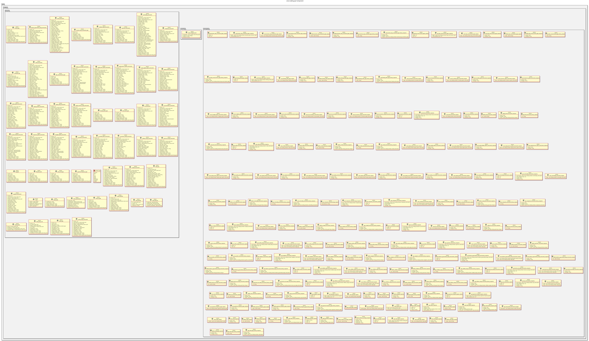

:PROPERTIES:
:ID: FD34A3B5-0E24-467A-A9D7-A2F2E7480E1B
:END:
#+title: ores.trading.api
#+name: trading.api
#+full_name: ores.trading.api
#+description: Protocol types, domain entities, JSON/table I/O, and NATS message schemas for the trading component.
#+type: ores.codegen.component
#+level: cross
#+filetags: :trading:api:component:
#+created: 2026-05-19
#+updated: 2026-05-19

* Diagram

#+attr_html: :width 100% :alt ores.trading.api component diagram
#+caption: ores.trading.api

* Summary

=ores.trading.api= is a header-only library that defines the shared contract
for the trading domain. It provides all instrument and trade domain types
(~30 instrument categories across rates, FX, equity, credit, and scripted
products), JSON and formatted-table I/O generated via the =rfl= reflection
library, and the NATS message protocol schemas (request/response pairs for
every operation in the 0x5000–0x5FFF range). Both =ores.trading.core= (the
server) and Qt client components depend on this library.

* Inputs

- Upstream domain definitions: instrument type headers under =domain/=.
- Protocol schema definitions: message type headers under =messaging/=.

* Outputs

- C++ headers for all trading domain types with JSON and table serialisation:
  =domain/trade.hpp=, =domain/bond_instrument.hpp=, etc.
- NATS protocol headers: =messaging/trade_protocol.hpp=,
  =messaging/instrument_protocol.hpp=, and per-instrument variants.
- Enumeration types with JSON/table I/O: =activity_type=, =trade_type=,
  =day_count_fraction_type=, etc.

* Entry points

- =include/ores.trading.api/domain/= — all domain entity headers.
- =include/ores.trading.api/messaging/= — all NATS protocol message headers.
- =include/ores.trading.api/export.hpp= — DLL-export macro.

* Dependencies

- =rfl= — JSON serialisation and table output via C++ reflection.
- =fort= — formatted table rendering.

* See also

- [[id:5C7A961E-D834-4B2F-AE15-F049B27361D8][ores.trading]] — component group overview.

- [[id:E9A3F7B2-6C14-4D8E-A5B9-3F2D1C0E7A6B][ores.trading.core]] — business logic, persistence, and NATS handlers.
- [[id:0D9D09ED-2FD1-402A-9624-31E26D10812E][ores.trading Messaging Reference]] — full NATS subject and message catalogue.
