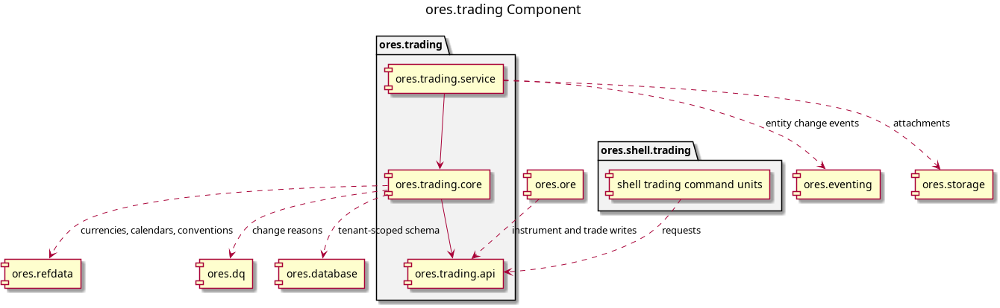

:PROPERTIES:
:ID: 5C7A961E-D834-4B2F-AE15-F049B27361D8
:END:
#+title: ores.trading
#+description: Provides domain types, repositories, services and protocol support for trade management including trade types, lifecycle events, party roles and trade identifiers.
#+type: ores.codegen.component
#+level: cross
#+filetags: :trading:component:
#+created: 2026-06-02
#+updated: 2026-10-01
#+name: trading
#+full_name: ores.trading
#+brief: Trading domain component
#+component_kind: composite
#+parts: api core service

* Diagram

#+attr_html: :width 100% :alt ores.trading component diagram
#+caption: ores.trading

* Summary

=ores.trading= holds the trade and instrument model: the trade envelope and
its lifecycle, the instrument identity, and one table per product family
across rates, FX, equity, credit, commodity, scripted and bond products.
The component is a composite of three parts. The =api= part is the shared
contract, =core= holds the repositories, readers and services, and
=service= wires the NATS handlers into a runnable binary. The entity
models under =modeling/= are the literate source every one of those is
generated from, together with the SQL schema, the shell command units and
their recipes.

* Sub-components

| Sub-component | Brief |
|---------------+-------|
| [[id:FD34A3B5-0E24-467A-A9D7-A2F2E7480E1B][ores.trading.api]] | Protocol types, domain entities, JSON/table I/O, and NATS message schemas for the tradi… |
| [[id:E9A3F7B2-6C14-4D8E-A5B9-3F2D1C0E7A6B][ores.trading.core]] | Trade booking and lifecycle management — domain model, repositories, services, and NATS… |
| [[id:0EBAD7F6-F0DF-4FF5-8404-C3F0EA8E8BBD][ores.trading.service]] | NATS service entrypoint for the trading domain — wires handlers, repositories, and conf… |

* Entity modules

| Module | Brief |
|--------+-------|
| [[id:ADB1BEF9-D37B-45C2-8372-A603C7BB688E][ores.trading]] | Logical entities for the trading namespace. |

* Inputs

- The entity and operation models under =modeling/=, which are the source
  the domain types, repositories, services, messages and SQL are generated
  from.
- Reference data from =ores.refdata=: currencies, calendars, day count
  fractions, business day conventions and the other conventions a trade
  names.
- Change reasons from =ores.dq=, which every bitemporal write states.
- Parties and tenants from =ores.iam=, which scope every row.

* Outputs

- =libores.trading.api.so= — the domain, JSON and table I/O, and the NATS
  protocol headers.
- =libores.trading.core.so= — the repositories, the instruments and trade
  readers, and the services.
- =ores.trading.service= — the process that serves the trading subjects.
- The generated SQL schema and the shell command units, which land in
  =projects/ores.sql/= and =projects/ores.shell/trading/=.

* Entry points

- =ores.trading.service= — the NATS service binary.
- =include/ores.trading.api/= — every public header a consumer includes.
- The shell menu =trading=, whose verbs come from the component's opted-in
  entity models.

* Dependencies

- =ores.trading.api= — the contract the other two parts and every consumer
  build against.
- =ores.database= — the tenant-scoped connection and the bitemporal
  helpers.
- =ores.eventing= and =ores.nats= — the transport and the entity change
  events.
- =ores.refdata=, =ores.dq= and =ores.iam= — the read-only data above.
- =ores.ore= consumes =ores.trading.api= to write ORE documents as trades.

* See also

- [[id:FD34A3B5-0E24-467A-A9D7-A2F2E7480E1B][ores.trading.api]] — the shared contract.
- [[id:E9A3F7B2-6C14-4D8E-A5B9-3F2D1C0E7A6B][ores.trading.core]] — the business logic and persistence.
- [[id:0EBAD7F6-F0DF-4FF5-8404-C3F0EA8E8BBD][ores.trading.service]] — the service binary.
- [[id:0DC1BAC7-DDAE-4F64-B800-49FBF8D723C1][Clean ores.trading to the component clean standard]] — the work that brought the component to the standard.
