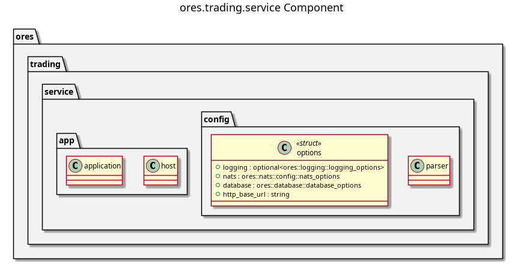

:PROPERTIES:
:ID: 0EBAD7F6-F0DF-4FF5-8404-C3F0EA8E8BBD
:END:
#+title: ores.trading.service
#+description: NATS service entrypoint for the trading domain — wires handlers, repositories, and configuration.
#+type: ores.codegen.component
#+level: cross
#+filetags: :trading:service:component:
#+created: 2026-05-19
#+updated: 2026-05-19
#+name: trading.service
#+full_name: ores.trading.service
#+brief: Trade booking and lifecycle service

* Diagram

#+attr_html: :width 100% :alt ores.trading.service component diagram
#+caption: ores.trading.service

* Summary

=ores.trading.service= is the NATS service entrypoint for the trading domain.
It is a thin wiring layer: it reads configuration, opens database and NATS
connections, registers all message handlers from =ores.trading.core=, and runs
the event loop. All business logic lives in =ores.trading.core=; this component
is responsible only for bootstrap, dependency injection, and graceful shutdown.

* Inputs

- Configuration file: NATS server URL, PostgreSQL connection string, logging
  settings, and environment name.
- NATS request messages from Qt clients and peer services on the
  =ores.trading.*= subject hierarchy.

* Outputs

- A running NATS service handling all trading operations (0x5000–0x5FFF range).
- NATS response messages returned to callers.
- Structured logs to the configured log sink via =ores.logging=.

* Entry points

- =src/main.cpp= — process entry point; initialises logging and starts the
  application.
- =src/application.cpp= — bootstraps all subsystems and wires dependencies.
- =src/host.cpp= — manages the NATS connection and handler registration loop.
- =src/config/= — configuration parsing and validation.

* Dependencies

- =ores.trading.core= — all NATS handlers, repositories, and domain services.
- =ores.trading.api= — shared protocol types.
- =ores.logging= — structured logging infrastructure.
- =nats.c= — NATS client for connection management.

* See also

- [[id:5C7A961E-D834-4B2F-AE15-F049B27361D8][ores.trading]] — component group overview.

- [[id:E9A3F7B2-6C14-4D8E-A5B9-3F2D1C0E7A6B][ores.trading.core]] — all business logic for the trading domain.
