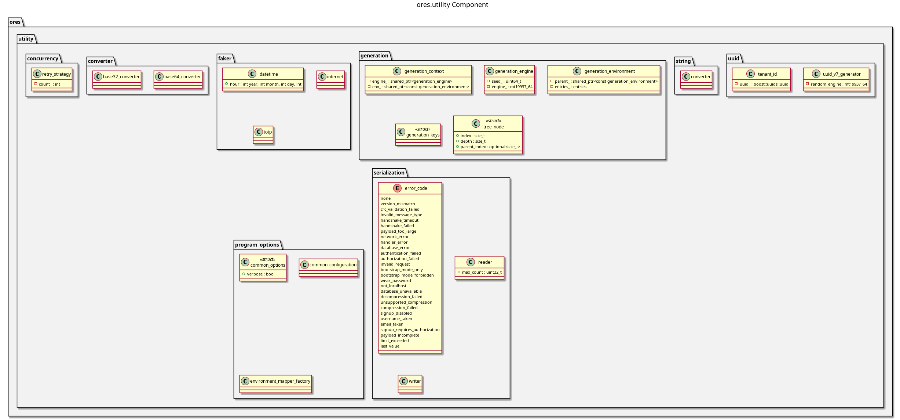

:PROPERTIES:
:ID: 00E33570-F7BE-7F94-FD83-2FDC9CB04463
:END:
#+title: ores.utility
#+name: utility
#+full_name: ores.utility
#+description: Foundation utilities — Base64/32 encoding, datetime helpers, test data generation (faker), and geo-coordinate types.
#+type: ores.codegen.component
#+level: cross
#+filetags: :utility:foundation:component:
#+created: 2026-05-20
#+updated: 2026-05-20

* Diagram

#+attr_html: :width 100% :alt ores.utility component diagram
#+caption: ores.utility

* Summary

=ores.utility= is the foundation utilities library for ORE Studio with no
dependencies on any other ORE Studio component. It provides Base64/Base32
encoding, datetime formatting/parsing, UUID v7 generation (RFC 9562, sortable
by time), reflect-cpp type reflectors for common types (UUID, time_point, IP
address), test data generation (faker), concurrency helpers, and iostream
streaming operators for standard types. Database, logging, and platform
abstractions that originally lived here have been split out into =ores.database=,
=ores.telemetry=, and =ores.platform= respectively.

* Inputs

- Raw data or strings passed to encoding/decoding functions.
- Timestamp strings or =time_point= values for datetime utilities.
- Random seed / system state for UUID v7 and faker generation.

* Outputs

- Base64/Base32 encoded or decoded strings.
- Formatted datetime strings and parsed =time_point= values.
- Time-ordered =boost::uuids::uuid= values.
- Serialised and deserialised reflect-cpp values for common types.

* Entry points

- =include/ores.utility/convert/= — Base64/Base32 codecs.
- =include/ores.utility/uuid/= — =uuid_v7_generator=.
- =include/ores.utility/datetime/= — datetime formatting and parsing.
- =include/ores.utility/faker/= — internet and TOTP test data generators.
- =include/ores.utility/rfl/= — reflect-cpp reflectors for UUID, time_point, IP.
- =include/ores.utility/streaming/= — iostream operators for standard types.
- =include/ores.utility/concurrency/= — concurrency helpers.

* Dependencies

- Boost.UUID, Boost.Asio — UUID and IP address types.
- =rfl= — reflect-cpp serialisation.

* See also

-
