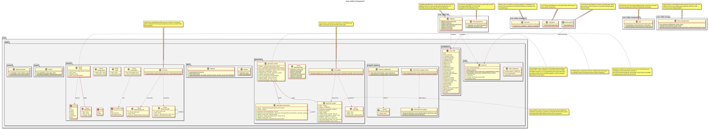

:PROPERTIES:
:ID: 00E33570-F7BE-7F94-FD83-2FDC9CB04463
:END:
#+title: ores.utility
#+name: utility
#+full_name: ores.utility
#+description: Foundation utilities: Base64, gzip and SHA-256, UUID v7 and tenant identity, reflect-cpp reflectors, the seeded generation engine, program-options mapping, short-code strings, and test data generation.
#+type: ores.codegen.component
#+level: cross
#+filetags: :utility:foundation:component:
#+created: 2026-05-20
#+updated: 2026-09-26

* Diagram

#+attr_html: :width 100% :alt ores.utility component diagram
#+caption: ores.utility

* Summary

=ores.utility= is the foundation library every other component builds on.
It holds the small, dependency-light pieces that more than one component
needs: byte codecs, identity types, the reflect-cpp reflectors that bind
those types to JSON, and the seeded engine that generates test data.

It has exactly one ORE Studio dependency, =ores.platform.lib=, taken as a
public link because =rfl= arrives through it. Nothing else in the tree is
imported here, so the component sits at the bottom of the dependency graph
and any other component may use it without risking a cycle. The previous
claim that it had no ORE Studio dependency was wrong: =src/CMakeLists.txt=
links =ores.platform.lib= =PUBLIC=.

The component is model-free. It owns no entity, no junction and no
operation, so nothing here is generated from a model and nothing here is
regenerated. The single exception is the version facet, which CMake
stamps from =version.hpp.in=. The component's own =version.hpp= is
generated; the facet holds only the template.

Consumption is very uneven, and the load-bearing facets are few.
=ores.utility/rfl/= reaches 856 C++ files outside the component,
=generation/= 460, =uuid/= 432, =domain/= 251, =streaming/= 80 and
=version/= 41. Of the rest, =faker/= reaches 10, =program_options/= 6,
=convert/= 4, =crypto/= 3, =compression/= 2, and =serialization/= and
=string/= one each. Five of them reach fewer than five. The thin end is
still live; the survey that preceded this pass found six sub-trees whose
only consumer was their own test, and those are gone.

* Facets

- =compression/= — =gzip_compress= and =gzip_decompress= over raw bytes.
  This is the one gzip implementation in the tree; =ores.nats= and
  =ores.storage= both call it rather than linking zlib themselves.
- =convert/= — =base64_converter=, an encoder and decoder with the
  standard alphabet and padding.
- =crypto/= — =sha256=, a hex-encoded lowercase digest over a string or a
  file.
- =domain/= — =hierarchy=, the entity-agnostic id/parent-id/name row a
  recursive-CTE query returns, and =protocol.hpp=, the domain's request
  outcome enumeration. Both are described under
  [[*Recorded exceptions][Recorded exceptions]].
- =faker/= — =internet= and =datetime=, the parts of the faker-cxx
  library the tree extends for its own test data. A TOTP secret generator
  lived here and is gone; no production code consumed it.
- =generation/= — the seeded generation engine. =generation_engine=
  derives every random value from one =mt19937_64=, =generation_context=
  pairs an engine with a scoped environment, =generation_environment= is
  that environment's parent-child key-value store, =generation_keys=
  names the well-known entries, and =tree_builder= assembles a
  parent-first node list for a self-referencing table.
- =program_options/= — =common_configuration= for the options every
  application shares, =environment_mapper_factory= for the
  =ORES_<DOMAIN>_<OPTION>= convention, and =shared_domain_registry= for
  the domains whose options are unprefixed.
- =rfl/= — =reflectors.hpp=, the =Reflector<>= specialisations that bind
  =boost::uuids::uuid=, =tenant_id=, =std::optional<uuid>=,
  =std::chrono::year_month_day=, =boost::asio::ip::address= and the
  domain =error_code= to their JSON spellings, plus
  =time_point_parser.hpp=.
- =serialization/= — =error_code.hpp=, the wire error enumeration, which
  is described under [[*Recorded exceptions][Recorded exceptions]].
- =streaming/= — =std_vector.hpp= and the =tenant_id= and =uuid= parsers
  that let reflect-cpp read and write those types in a stream.
- =string/= — =short_code_generator=, which strips corporate suffixes
  from a counterparty name and reduces it to a short code. It mirrors the
  =ores_utility_strip_corporate_suffix_fn= SQL function.
- =uuid/= — =uuid_v7_generator=, RFC 9562 version 7 identifiers that sort
  by creation time, and =tenant_id= with its nil, system and string
  forms.
- =version/= — the CMake-stamped product version. Only the =version.hpp.in=
  and =version.cpp.in= templates live in the component.

* Inputs

- Raw byte spans for compression, Base64 and the SHA-256 digest.
- Strings, file paths and time points for the conversion helpers.
- A seed, and the key-value entries a caller pushes into the generation
  environment.
- Counterparty names for the short-code reduction.
- Command-line arguments and =ORES_*= environment variables.
- JSON text, for the types the reflectors bind.

* Outputs

- Compressed and decompressed bytes, Base64 text, and hex digests.
- Version 7 UUIDs, =tenant_id= values and their string forms.
- A parent-first =tree_node= list, ready to insert into a table with a
  self-referencing foreign key.
- A short code, and the common options description a caller registers.
- JSON for the reflected types, in both directions.
- The product version string.

* Entry points

- =include/ores.utility/compression/= — =gzip_compress=,
  =gzip_decompress=.
- =include/ores.utility/convert/= — =base64_converter=.
- =include/ores.utility/crypto/= — =sha256=.
- =include/ores.utility/domain/= — =hierarchy=, =protocol.hpp=.
- =include/ores.utility/faker/= — =internet=, =datetime=.
- =include/ores.utility/generation/= — =generation_engine=,
  =generation_context=, =generation_environment=, =generation_keys=,
  =tree_builder=.
- =include/ores.utility/program_options/= — =common_configuration=,
  =environment_mapper_factory=, =shared_domain_registry=.
- =include/ores.utility/rfl/= — =reflectors.hpp=,
  =time_point_parser.hpp=.
- =include/ores.utility/serialization/= — =error_code=.
- =include/ores.utility/streaming/= — =std_vector.hpp=,
  =tenant_id_parser.hpp=, =uuid_parser.hpp=.
- =include/ores.utility/string/= — =short_code_generator=.
- =include/ores.utility/uuid/= — =uuid_v7_generator=, =tenant_id=.
- =include/ores.utility/version/= — =version.hpp=, generated.

* Recorded exceptions

Two hand-written wire artefacts stay, and neither is a candidate for a
model.

- =domain/protocol.hpp= is a 124-line request-outcome enumeration that
  reaches 245 C++ files outside the component, and the codegen templates
  themselves include it. It is load-bearing for generation, so it cannot
  become a per-entity model. This is the M06 exception, and its reason is
  the template dependency.
- =serialization/error_code.hpp= speaks the binary protocol that is
  retired, and its only consumer left is
  =ores.iam.core/service/signup_service.hpp=. It belongs with messaging
  rather than in a foundation library. The move is recorded for separate
  work; deleting it is not available while that consumer stands.

* Dependencies

- The C++ standard library.
- =ores.platform.lib=, public, which also supplies =rfl=.
- =Boost::exception=, =Boost::iostreams= and =Boost::program_options=.
- =OpenSSL::Crypto=, private, for the SHA-256 digest.
- =faker-cxx=, private, for the faker facet.

* See also

- [[id:45CAC01F-BC56-4600-B206-EEE7545AE3AB][Component Architecture Audit]] -- the structural checklist and the placement rules this component is measured against.
- [[id:7B477025-132E-4B20-80B4-D8C9420880B8][Component Clean Standard]] -- the checklist this component was worked through.
- [[id:B079DA67-8408-4BD0-A93C-D108AC780872][Facet]] -- the catalogue that fixes the facet folder names above.
- [[id:B9D3D469-9E59-465F-8C18-34546B680D13][Component Documentation Guide]] -- what fills this overview well.
- [[id:271F40DA-D0EA-4D08-A4F8-3D2B835DF5E7][PlantUML class diagram conventions]] -- the rules the component diagram follows.
- [[id:FB797194-EB03-4837-B12D-E651DD5F16F2][Unit test conventions]] -- the Catch2 conventions the component's tests follow.
- [[id:0FB2EA84-EBB8-45C8-A8C8-F5815431C2D2][Code Review Checklist]] -- the naming and component-only checks this component passes.
