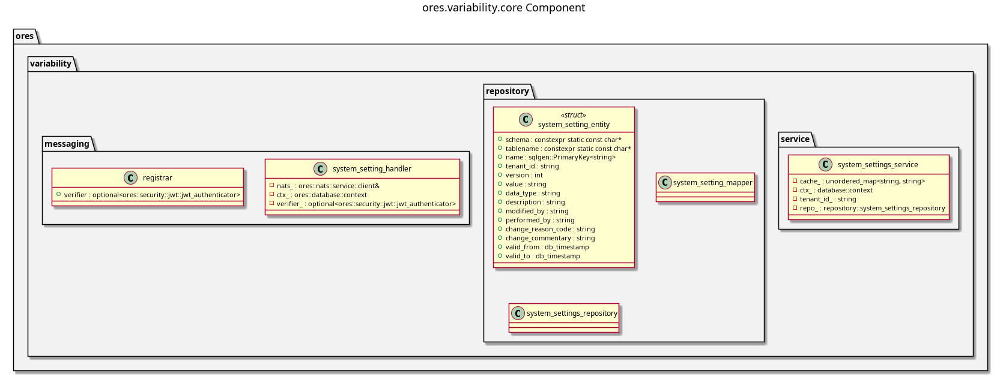

:PROPERTIES:
:ID: 1EE1B07C-3EC4-9BC4-1C4B-5BD458A8B2E5
:END:
#+title: ores.variability.core
#+name: variability.core
#+full_name: ores.variability.core
#+description: System variability and configuration management — feature flags, settings, and temporal change tracking.
#+type: ores.codegen.component
#+level: cross
#+filetags: :variability:core:component:
#+created: 2026-05-19
#+updated: 2026-05-19

* Diagram

#+attr_html: :width 100% :alt ores.variability.core component diagram
#+caption: ores.variability.core

* Summary

=ores.variability.core= manages system-wide configuration and runtime
variability for ORE Studio. It stores feature flags and system settings in the
database with bitemporal versioning (so any configuration change can be audited
and rolled back), and exposes NATS handlers for querying and updating settings
at runtime. Other components depend on this library to drive runtime-
configurable behaviour without redeployment.

* Inputs

- NATS request messages for setting query/update operations.
- PostgreSQL connections to the =ores_variability_*= tables with temporal
  versioning.

* Outputs

- System-setting records persisted to the =ores_variability= schema with
  bitemporal history.
- NATS response messages returned to callers.

* Entry points

- =include/ores.variability.core/ores.variability.hpp= — aggregate include.
- =include/ores.variability.core/messaging/registrar.hpp= — registers NATS
  handlers with the service host.
- =include/ores.variability.core/service/= — setting management services.
- =include/ores.variability.core/repository/= — ORM entities and mappers.

* Dependencies

- =ores.variability.api= — shared domain types and NATS protocol schemas.
- =ores.dq= — ORM base classes.
- =rfl= — JSON serialisation via reflection.
- =soci= — SQL ORM for PostgreSQL persistence.
- =nats.c= — NATS messaging client.

* See also

- [[id:26218AD6-C63E-44E8-9B92-7FB51C366566][ores.variability.api]] — protocol types and domain entities.
- [[id:95D9E246-27ED-440F-B14A-481A546B7C4F][ores.variability.service]] — NATS service entrypoint.
- [[id:E4D5F6A7-B8C9-0123-DEFA-234567890123][ores.variability Messaging Reference]] — full NATS subject and message catalogue.
