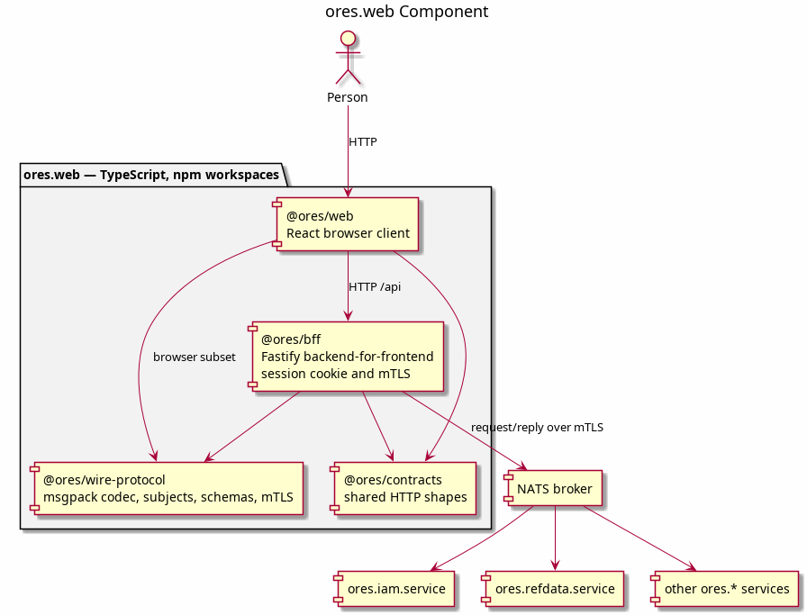

:PROPERTIES:
:ID: 60088AA3-832B-45F1-91C2-4723C75554EE
:END:
#+title: ores.web
#+description: TypeScript web UI for ORE Studio: a browser client, a Fastify BFF that owns the NATS mTLS connection, and the shared HTTP and wire-protocol packages.
#+type: ores.codegen.component
#+level: cross
#+filetags: :web:typescript:react:nats:bff:
#+created: 2026-09-19
#+updated: 2026-09-19
#+name: web
#+full_name: ores.web
#+brief: Browser UI for ORE Studio, served by its own backend-for-frontend.

* Diagram

#+attr_html: :width 100% :alt ores.web component diagram
#+caption: ores.web

* Summary

=ores.web= is the browser interface for ORE Studio. It replaces the removed Qt
desktop client. A browser cannot present a NATS client certificate on a
WebSocket, so the component pairs a React client with a Fastify
backend-for-frontend (BFF) that owns the mTLS connection to the broker.

The component is a TypeScript project. It has no C++ parts and no compiled
CMake target. The four npm packages under =packages/= are its structure: =bff=,
=contracts=, =web=, and =wire-protocol=. It builds with =npm ci= and
=npm run build= from the component root.

* Inputs

- The checkout =.env=, through =ORES_WEB_*= for the process settings and
  =ORES_NATS_*= for the broker.
- The site configuration in =config/environments.json=, or the file named by
  =ORES_WEB_SITE_CONFIG=. It declares the environments, the active environment,
  the developer surface, and the ACME test accounts.
- NATS responses over mTLS from =ores.iam.service=, =ores.refdata.service=, and
  the other domain services.
- Change notifications that the services publish on their event subjects.
- The org entity models under =projects/ores.*/modeling/=, which =ores.codegen=
  reads at build time to generate the TypeScript protocol and domain types.
- Browser requests on the =/api= HTTP surface.

* Outputs

- The built browser bundle in =packages/web/dist=. The BFF serves it on
  =ORES_WEB_PORT=.
- The =/api= HTTP surface on the same port.
- NATS requests and subscriptions that the BFF sends on behalf of the browser.
- A first-party session cookie that holds the session token. The browser never
  receives the token itself.
- Generated TypeScript in =packages/wire-protocol/src/generated/=.

* Entry points

- =projects/ores.web/README.md= — component overview and operator instructions.
- =projects/ores.web/packages/bff/src/main.ts= — the BFF process entry point.
- =projects/ores.web/packages/bff/src/server.ts= — the Fastify HTTP surface and
  the static browser bundle.
- =projects/ores.web/packages/web/src/main.tsx= — the React browser entry point.
- =projects/ores.web/package.json= — the workspace scripts: =build=, =test=,
  =typecheck=, =verify:login=, and =seed:account=.

* Dependencies

- =ores.iam.service= — authentication, sessions, accounts, and change reasons.
- =ores.refdata.service= — reference data such as countries.
- The other domain services that the browser reaches through the BFF.
- =ores.codegen= — build-time generation of the TypeScript protocol and domain
  types.
- Node.js 22 or later.
- Third-party libraries: Fastify, React, React Router, TanStack Query, TanStack
  Table, NATS.js, =@msgpack/msgpack=, Zod, Vite, Tailwind CSS, Vitest, and
  Playwright.
- The component links no C++ library, because it has no C++ parts.

* See also

- [[id:67E68899-3D29-4861-B4F8-B0C9536EC4C1][The entity specification]] — a
  superseded specification. It required one shared list, detail and history screen
  per entity, driven by a generated declaration; those screens are deleted and the
  interface is to be built from hand-written journey screens instead.
- [[id:DD0C6CEB-A285-40F5-8A97-B39DA6953B20][The component specification]] —
  the browser shell, the session, the transport to the BFF, the i18n catalogue,
  the styling, and the wire-protocol package.
- [[id:F489BD14-CB2D-445F-9EDC-0CF4AC7F2A42][Change notification]] — the channel
  to the browser, the payload, and the visual language.
- [[id:46F465EE-7693-4852-B125-12C56290B695][Icon reference]] — the icon
  vocabulary and the process for adding to it.
- [[id:1B37530D-0729-4DA2-B586-629C08F9370F][Gaps: country against the
  specification]] — a superseded audit. It measured screens and shared controls
  that are now deleted, and its findings cannot be reproduced.
- [[id:2BF2FFC1-B6A0-495E-9B14-E26ACF09EA55][Qt account screen: raw reference
  analysis]] — the historical analysis of the removed Qt client.
- [[id:5E4C1A90-3B27-4E6D-9F01-7A2C8D4B6E15][Protocol types are generated from
  the C++ codegen model]] — the decision behind the generated wire types.
- [[id:7F1B2C44-9A3E-4D58-B6E1-2C7A5D9E4F80][The connections store was removed,
  and why]] — why the per-user connection store is gone.
- [[id:08FBD248-257A-A474-DD43-DB08949978F1][ores.codegen]] — the generator that
  produces the TypeScript.
- [[id:70F2D886-BB3F-4FE0-929C-45509E1CE967][ores.iam.service]] — the
  authentication service the browser signs in through.
- [[id:E75568D2-588A-4FE2-9ED1-6826B60C0E10][ores.refdata.service]] — the
  reference-data service behind the entity screens.
- [[id:F27E5DF7-6223-4B6F-80A5-CEFBEB1BC756][Component architecture]] — the
  component layout conventions this component follows.
