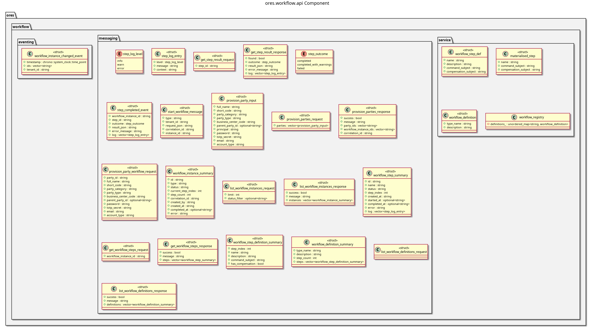

:PROPERTIES:
:ID: 85319483-4AE9-4162-91F7-D72A8201134B
:END:
#+title: ores.workflow.api
#+description: Domain types and NATS protocol schemas for the workflow component.
#+type: ores.codegen.component
#+level: cross
#+filetags: :workflow:api:component:
#+created: 2026-05-19
#+updated: 2026-05-19
#+name: workflow.api
#+full_name: ores.workflow.api
#+brief: Workflow public API types and helpers

* Diagram

#+attr_html: :width 100% :alt ores.workflow.api component diagram
#+caption: ores.workflow.api

* Summary

=ores.workflow.api= is a header-only library defining the shared contract for
the workflow domain. It provides workflow and workflow-step domain types with
JSON I/O via =rfl=, and the NATS protocol schemas consumed by
=ores.workflow.core= and Qt clients.

* Inputs

- Domain entity type definitions across =domain/= headers.

* Outputs

- C++ headers for workflow domain types with JSON I/O.
- NATS protocol headers for workflow management operations.

* Entry points

- =include/ores.workflow.api/domain/= — all domain entity headers.
- =include/ores.workflow.api/messaging/= — NATS protocol message headers.

* Dependencies

- =rfl= — JSON serialisation via reflection.

* See also

- [[id:7F4B91E2-3D86-4A57-B92C-08E146DA7359][ores.workflow]] — component group overview.

- [[id:440294D7-385D-41EE-92CB-CAB937E65E81][ores.workflow.core]] — business logic, persistence, and NATS handlers.
