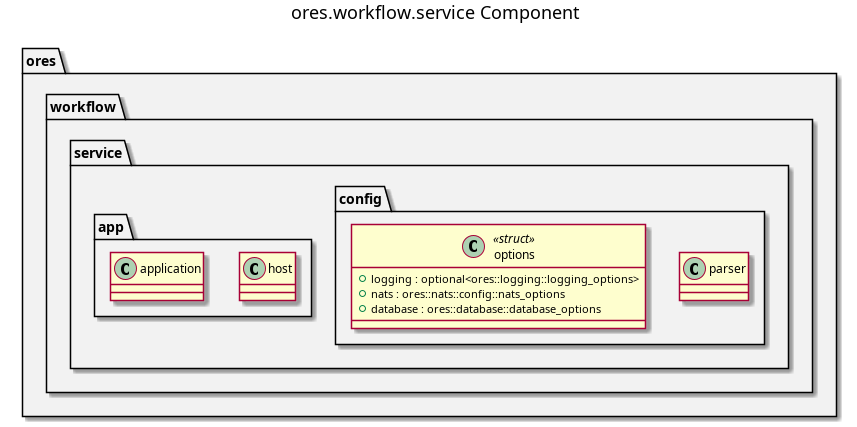

:PROPERTIES:
:ID: 1AF4AEC8-70EC-496C-821E-4E2E1BB303E5
:END:
#+title: ores.workflow.service
#+description: NATS service entrypoint for the workflow domain.
#+type: ores.codegen.component
#+level: cross
#+filetags: :workflow:service:component:
#+created: 2026-05-19
#+updated: 2026-05-19
#+name: workflow.service
#+full_name: ores.workflow.service
#+brief: Workflow orchestration microservice

* Diagram

#+attr_html: :width 100% :alt ores.workflow.service component diagram
#+caption: ores.workflow.service

* Summary

=ores.workflow.service= is the NATS service entrypoint for the workflow domain.
It reads configuration, opens database and NATS connections, registers all
message handlers from =ores.workflow.core=, and runs the event loop.

* Inputs

- Configuration file: NATS server URL, PostgreSQL connection string.
- NATS request messages for workflow management operations.

* Outputs

- A running NATS service for workflow operations.
- NATS response messages returned to callers.

* Entry points

- =src/main.cpp=, =src/app/=, =src/config/=.

* Dependencies

- =ores.workflow.core=, =ores.workflow.api=, =ores.logging=, =nats.c=.

* See also

- [[id:7F4B91E2-3D86-4A57-B92C-08E146DA7359][ores.workflow]] — component group overview.

- [[id:440294D7-385D-41EE-92CB-CAB937E65E81][ores.workflow.core]] — all business logic for the workflow domain.
