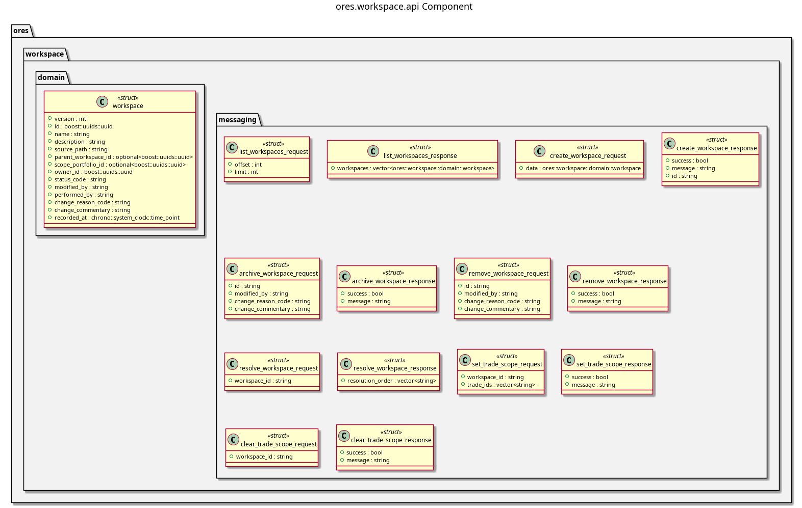

:PROPERTIES:
:ID: A4B3EADA-2C71-4F67-B864-8CC1E579B279
:END:
#+title: ores.workspace.api
#+description: Domain types and NATS protocol for user workspace state (saved layouts, preferences).
#+type: ores.codegen.component
#+level: cross
#+filetags: 
#+created: 2026-07-29
#+updated: 2026-07-29
#+name: workspace.api
#+full_name: ores.workspace.api
#+brief: Workspace domain types

* Diagram

#+attr_html: :width 100% :alt ores.workspace.api component diagram
#+caption: ores.workspace.api

* Summary

(Three to five sentences: what this component does and why it exists.)

* Inputs

-

* Outputs

-

* Entry points

-

* Dependencies

-

* See also

-
