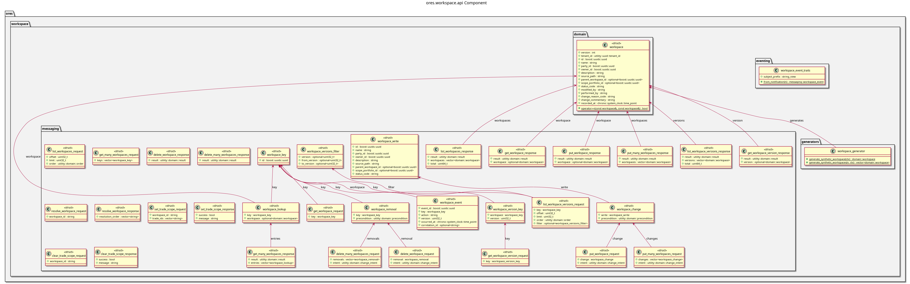

:PROPERTIES:
:ID: A4B3EADA-2C71-4F67-B864-8CC1E579B279
:END:
#+title: ores.workspace.api
#+description: Domain type, protocols and generator for the workspace component, generated from the workspace entity and operation models.
#+type: ores.codegen.component
#+level: cross
#+filetags: :workspace:api:component:
#+created: 2026-07-29
#+updated: 2026-09-28
#+name: workspace.api
#+full_name: ores.workspace.api
#+brief: Workspace domain types

* Diagram

#+attr_html: :width 100% :alt ores.workspace.api component diagram
#+caption: ores.workspace.api

* Summary

=ores.workspace.api= is the shared contract for the workspace domain. It
carries the workspace domain type with its JSON, table and table-I/O
companions, the canonical entity protocol and change event, the protocol for
the two workspace operations, and the synthetic workspace generator.

Everything here is generated. =modeling/ores.workspace.workspace.org= drives
the domain type, its protocol, its change event and its generator, and
=modeling/ores.workspace.workspace_operations.org= drives the resolution and
trade-scope protocol. Only the export header is hand-written.

* Inputs

- The entity model =modeling/ores.workspace.workspace.org=.
- The operation model =modeling/ores.workspace.workspace_operations.org=.

* Outputs

- C++ headers for the workspace domain type with JSON and table I/O.
- The canonical entity protocol for workspaces, its change event, and the
  operation protocol for the resolution chain and the trade scope.
- The synthetic workspace generator the component's suites seed with.

* Entry points

- =include/ores.workspace.api/domain/= — the domain type and its JSON, table and
  table-I/O companions.
- =include/ores.workspace.api/messaging/= — the entity protocol and the
  operation protocol.
- =include/ores.workspace.api/eventing/= — the generated change event.
- =include/ores.workspace.api/generators/= — the generated synthetic generator.

* Dependencies

- =rfl= — JSON serialisation via reflection.
- =fort= — formatted table rendering.
- =ores.utility= — the tenant identifier and the protocol envelope.

* See also

- [[id:E6134412-DF7E-4CBF-B2C2-BF84EDBC618E][ores.workspace]] — component group overview.
- [[id:DE0A6A1D-CD57-4156-8BCB-516294F7778D][ores.workspace.core]] — the layer that persists and serves these types.
