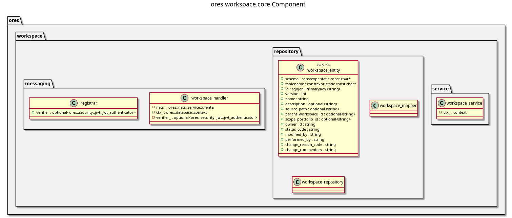

:PROPERTIES:
:ID: DE0A6A1D-CD57-4156-8BCB-516294F7778D
:END:
#+title: ores.workspace.core
#+description: Core workspace service implementation: persists and serves user workspace state.
#+type: ores.codegen.component
#+level: cross
#+filetags: 
#+created: 2026-07-29
#+updated: 2026-07-29
#+name: workspace.core
#+full_name: ores.workspace.core
#+brief: Workspace core services

* Diagram

#+attr_html: :width 100% :alt ores.workspace.core component diagram
#+caption: ores.workspace.core

* Summary

(Three to five sentences: what this component does and why it exists.)

* Inputs

-

* Outputs

-

* Entry points

-

* Dependencies

-

* See also

-
