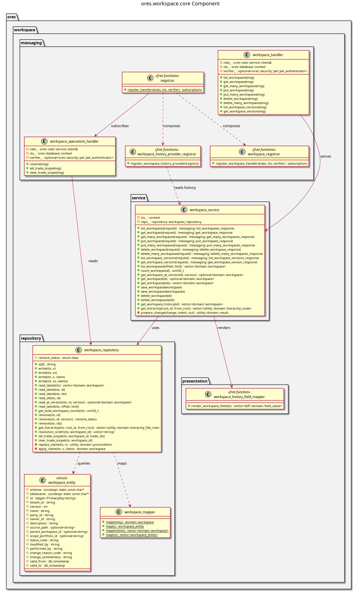

:PROPERTIES:
:ID: DE0A6A1D-CD57-4156-8BCB-516294F7778D
:END:
#+title: ores.workspace.core
#+description: Repository, service, handlers and registrars for the workspace component.
#+type: ores.codegen.component
#+level: cross
#+filetags: :workspace:core:component:
#+created: 2026-07-29
#+updated: 2026-09-28
#+name: workspace.core
#+full_name: ores.workspace.core
#+brief: Workspace core services

* Diagram

#+attr_html: :width 100% :alt ores.workspace.core component diagram
#+caption: ores.workspace.core

* Summary

=ores.workspace.core= persists workspaces and serves them over NATS. It holds
the generated repository, service and command handler for the workspace entity,
together with the generated history provider, presentation mapper and
sub-registrar.

The two workspace operations that are not entity verbs have hand-written
handlers beside the operation model that declares their subjects: the ancestry
resolution chain calls a set-returning SQL function, and the trade scope writes
a whitelist table no entity model describes. The component's registrar composes
all of them, and the generated event registrar wires the entity's change
pipeline.

* Inputs

- An =ores::database::context= per request: connection pool, tenant and actor.
- NATS command messages on the workspace subjects.

* Outputs

- Version rows in =ores_workspaces_tbl= and scope rows in
  =ores_workspace_trade_scope_tbl=.
- A NATS reply to every workspace subject.
- Workspace history, served through the generic history provider.

* Entry points

- =ores::workspace::messaging::registrar::register_handlers= — the one call the
  service application makes.
- =ores::workspace::repository::workspace_repository= — the generated CRUD set
  plus the resolution and trade-scope methods.
- =ores::workspace::service::workspace_service= — the generated service.

* Dependencies

- =ores.workspace.api= — the domain types and the protocols.
- =ores.database= — the connection context.
- =ores.nats= — the message bus.
- =ores.service= — the handler helpers and the request context.
- =ores.history= — the generic history provider.
- =ores.security= — the JWT verifier.

* See also

- [[id:E6134412-DF7E-4CBF-B2C2-BF84EDBC618E][ores.workspace]] — component group overview.
- [[id:A4B3EADA-2C71-4F67-B864-8CC1E579B279][ores.workspace.api]] — the types this layer serves.
- [[id:F07DD08A-1F8F-4DEF-9E4F-C8353016C854][ores.workspace.service]] — the process that hosts it.
