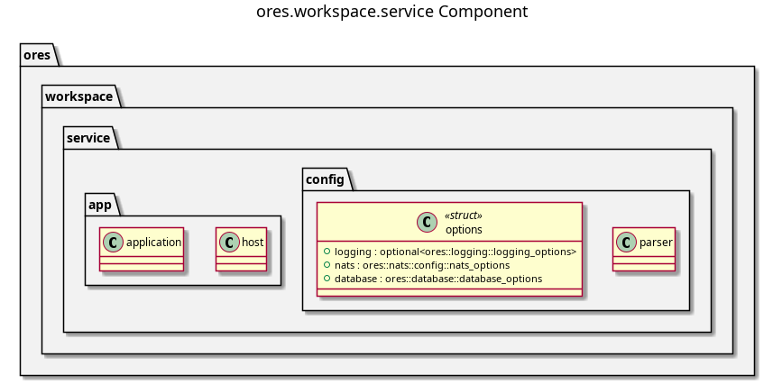

:PROPERTIES:
:ID: F07DD08A-1F8F-4DEF-9E4F-C8353016C854
:END:
#+title: ores.workspace.service
#+description: NATS service entrypoint for the workspace domain: wires handlers, repositories, and configuration.
#+type: ores.codegen.component
#+level: cross
#+filetags: 
#+created: 2026-07-29
#+updated: 2026-07-29
#+name: workspace.service
#+full_name: ores.workspace.service
#+brief: Workspace service entrypoint

* Diagram

#+attr_html: :width 100% :alt ores.workspace.service component diagram
#+caption: ores.workspace.service

* Summary

(Three to five sentences: what this component does and why it exists.)

* Inputs

-

* Outputs

-

* Entry points

-

* Dependencies

-

* See also

-
