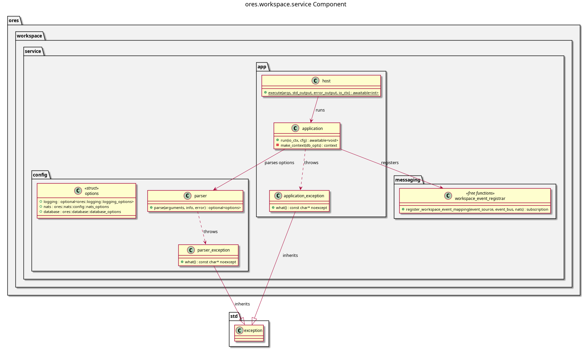

:PROPERTIES:
:ID: F07DD08A-1F8F-4DEF-9E4F-C8353016C854
:END:
#+title: ores.workspace.service
#+description: The process that hosts the workspace component: configuration, the change-event pipeline and the domain service runner.
#+type: ores.codegen.component
#+level: cross
#+filetags: :workspace:service:component:
#+created: 2026-07-29
#+updated: 2026-09-28
#+name: workspace.service
#+full_name: ores.workspace.service
#+brief: Workspace service entrypoint

* Diagram

#+attr_html: :width 100% :alt ores.workspace.service component diagram
#+caption: ores.workspace.service

* Summary

=ores.workspace.service= is the process that hosts the workspace component. It
parses the environment configuration, builds the database context, assembles
the PostgreSQL =LISTEN=/=NOTIFY= to NATS change-event pipeline through the
generated event registrar, and runs the domain service with the component's
registrar.

The change events the pipeline publishes are the workspace entity's: the
generated registrar owns the trigger's channel and the canonical event shape.

* Inputs

- The environment configuration: database credentials, the NATS endpoint and
  its TLS material, and the log destination.

* Outputs

- The =ores.workspace.service= process, subscribed to every workspace subject.
- Workspace change events published to NATS.

* Entry points

- =ores::workspace::service::app::application::run= — the service coroutine.
- =src/main.cpp= — the process entry point.

* Dependencies

- =ores.workspace.core= — the handlers and the registrar.
- =ores.eventing= — the change-event pipeline.
- =ores.service= — the domain service runner and the heartbeat publisher.
- =ores.database= — the connection context factory.

* See also

- [[id:E6134412-DF7E-4CBF-B2C2-BF84EDBC618E][ores.workspace]] — component group overview.
- [[id:DE0A6A1D-CD57-4156-8BCB-516294F7778D][ores.workspace.core]] — the handlers it hosts.
