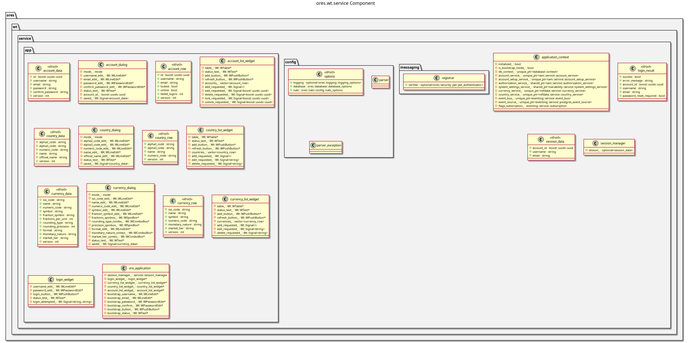

:PROPERTIES:
:ID: FE36240A-7A64-4332-9E82-8D976D458C73
:END:
#+title: ores.wt.service
#+name: wt.service
#+full_name: ores.wt.service
#+description: Wt C++ Web Toolkit frontend — account management, currency/country views, and session handling for ORE Studio.
#+type: ores.codegen.component
#+level: cross
#+filetags: :wt:web:frontend:component:
#+created: 2026-05-20
#+updated: 2026-05-20

* Diagram

#+attr_html: :width 100% :alt ores.wt.service component diagram
#+caption: ores.wt.service

* Summary

=ores.wt.service= is the Wt C++ Web Toolkit frontend for ORE Studio. It
provides browser-based views for account management, currency and country
data, and feature flags, with web-session authentication. The service
communicates with domain services via NATS (through =ores.service='s
=wt_service_runner=). It is an alternative to the Qt desktop client for
environments where a web UI is preferred or a desktop application is not
available.

* Inputs

- NATS responses from =ores.iam=, =ores.refdata=, and =ores.variability= services.
- HTTP requests from web browsers via the Wt embedded HTTP server.
- Configuration: NATS URL, HTTP bind address/port.

* Outputs

- Rendered Wt widget-based web pages for account/currency/country views.
- NATS request messages dispatched on user actions (create, edit, list).

* Entry points

- =src/main.cpp= — process entry point.
- =src/config/= — options parsing (NATS URL, HTTP bind).
- =src/app/= — Wt application widgets and dialogs.
- =src/service/= — session manager and application context.

* Dependencies

- Wt C++ Web Toolkit — embedded HTTP server and widget framework.
- =ores.service= — =wt_service_runner= lifecycle.
- =ores.iam.api=, =ores.refdata.api=, =ores.variability.api= — NATS protocol types.
- =ores.nats= — NATS transport.

* See also

-
