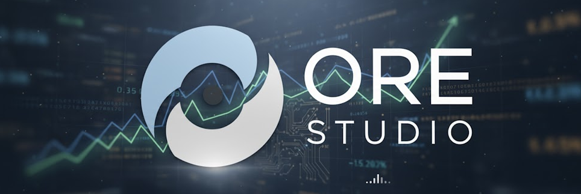
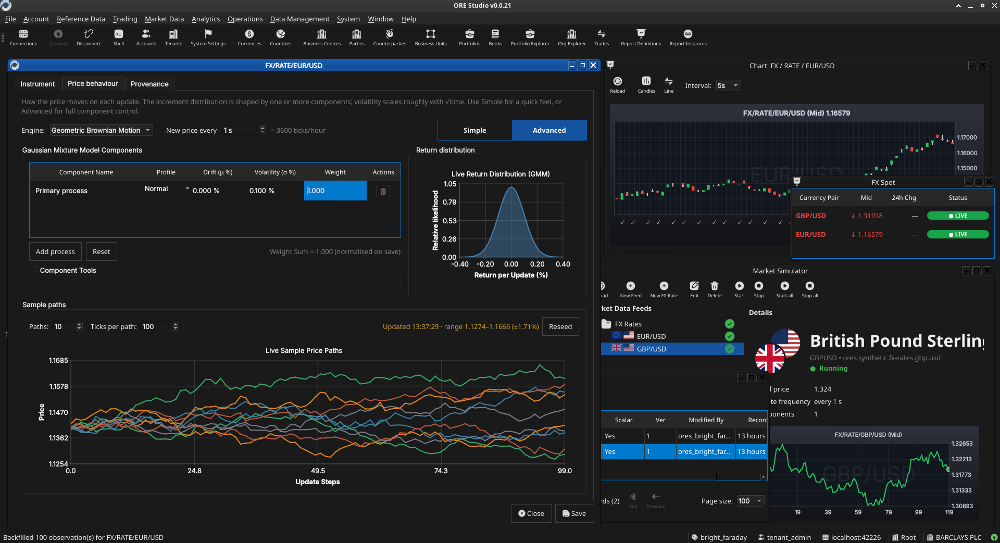

:PROPERTIES:
:ID: CB42DFE5-804B-E1C4-E1E3-0A6C4766609C
:END:
#+title: ORE Studio
#+description: Graphical front-end for the Open Source Risk Engine (ORE), built for learning quantitative finance by doing.
#+type: knowledge
#+level: cross
#+filetags: :readme:
#+created: 2024-06-15
#+updated: 2026-06-12
#+options: title:nil <:nil c:nil todo:nil ^:nil d:nil date:nil author:nil toc:nil html-postamble:nil
#+startup: inlineimages

#+HTML: 

#+html: 
#+html: 
#+html: 
#+html: 
#+html: 
#+html: 
#+html: 
#+html: 
#+html: 
#+html: 
#+html: 
#+html: 
#+html: 
#+html: 
#+html: 
#+html: 
#+html: 
#+html: 
#+html: 
#+html: 
#+html: 
#+html: 
#+html: 
#+html: 
#+html: 
#+html: 
#+html: 
#+html: 
#+html: 
#+html: 
#+html: 
#+HTML: 

* What is ORE Studio?

ORE Studio is a graphical front-end for the [[id:1CBDEA40-5FAE-4F04-BD21-2BB29172B5AA][Open Source Risk Engine]] (ORE), which
itself builds on [[id:0412444A-0A4C-4611-887C-09353A3CB253][QuantLib]]. It provides a database-backed UI for configuring and
running ORE — persistent storage for inputs and outputs, CRUD management, and a
simple three-layer architecture (client / service / [[id:81AB065B-E6EB-4CC2-BB18-F3FD2652EC47][PostgreSQL]]) designed to be
easy to understand and extend. ORE Studio was started by [[https://mcraveiro.github.io/][Marco Craveiro]].

The project is built for people who want to *learn quantitative finance by
building*. All the heavy mathematical lifting stays in ORE and QuantLib; ORE
Studio focuses on infrastructure, data management, and making the domain
accessible to C++ developers without an institutional background.

- *[[id:2F71292F-CDB0-4E2E-B50F-4F02E10597C4][Product identity]]* — goals, audience, scope and what ORE Studio is not.
- *[[id:C0CF98E8-082F-2F04-2533-94B2DA9BE3D2][Orientation]]* — how to navigate the documentation.
- *[[https://orestudio.github.io/OreStudio/][Website]]* — full documentation, recipes, and architecture reference.

* Getting started

Binary packages for each release are available on [[https://github.com/OreStudio/OreStudio/releases][GitHub Releases]] (Linux,
macOS, Windows — 64-bit). Per-commit packages are attached to the
corresponding [[https://github.com/OreStudio/OreStudio/actions][GitHub Actions workflow run]].

To build from source, follow the
[[https://orestudio.github.io/OreStudio/doc/recipes/cmake/how_do_i_set_up_a_dev_environment.html][How do I set up a development environment?]] recipe. Preset options and
platform notes are in the [[https://orestudio.github.io/OreStudio/doc/recipes/cmake/cmake.html][CMake recipes]].

* Contributing

[[https://github.com/OreStudio/OreStudio/blob/main/CONTRIBUTING.md][PRs are welcome.]] Join the [[https://discord.gg/ztAaxmsnUJ][Discord]] for questions and discussion.
